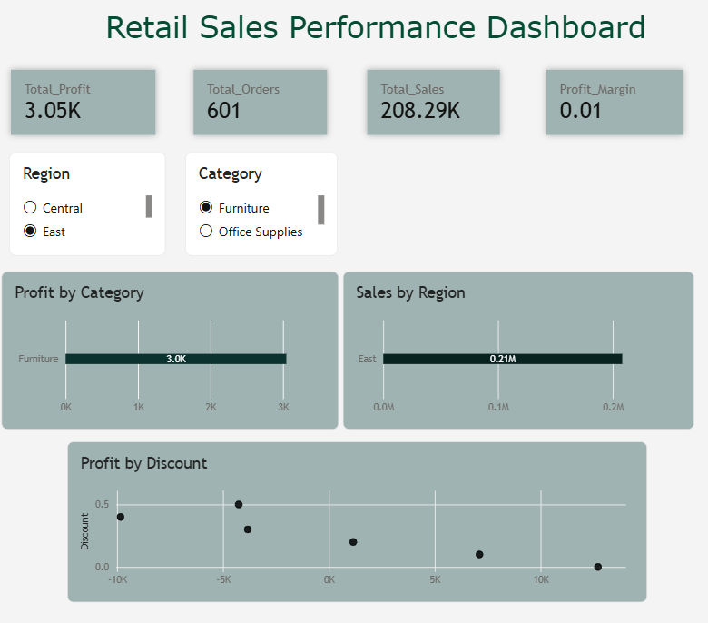

# Sales Performance Dashboard

## Business Question
How are sales and profit performing across categories and regions, and how does discounting impact profitability?

## Tools Used
Power BI Desktop (DAX measures, interactive slicers, KPI cards)

## DAX Measures Used
Total Sales = SUM(SampleSuperstore[Sales])
Total Profit = SUM(SampleSuperstore[Profit])
Profit Margin = DIVIDE([Total Profit], [Total Sales], 0)
Total Orders = COUNTROWS(SampleSuperstore)
Avg Discount = AVERAGE(SampleSuperstore[Discount])
Profit Status = IF([Total Profit] > 0, "Profitable", "Loss-Making")

## Dashboard Preview

Note: .pbix file included in this repo. Open in Power BI Desktop to interact with the slicers and filters.

## Key Insights
- Add your real insights here once you review the dashboard numbers

## Dataset
Sample Superstore Dataset (Kaggle)
